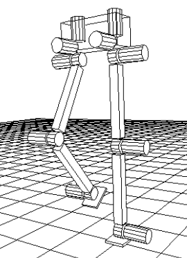

# report.md

## 实验目标
- 掌握强化学习在连续控制任务中的应用，通过智能体与环境的交互实现二足稳定行走控制。
- 训练智能体协调髋/膝等关节的运动策略，使系统在仿真环境中快速、平稳行走。
- 对比不同 Q 函数逼近模型的性能（MLP vs LSTM）；本项目按 AGENTS 约束仅完成 MLP，LSTM 由组内其他成员补充或作为后续工作说明。

## 二足系统介绍
Walker2d 是二维双足机器人模型，由单一躯干、左右两条大腿、左右两条小腿与左右脚共 7 个主要部件组成；通过连接这些部件的 6 个铰链关节施加力矩实现向前行走。（来源：Gymnasium Walker2d 文档）
本实验关注“结构—关节—力矩”的最小描述：每条腿 3 个关节（thigh/leg/foot），对应 6 个关节力矩输入，目标是在保持躯干稳定的同时获得持续前进。（来源：Gymnasium Walker2d 文档）

**图1 二足行走系统示意图**：Walker2d 环境官方示意图（用于展示 2D 双足结构与关节分布）。  

演讲稿：这张图展示了 Walker2d 的基础结构，它是一个二维平面内的双足系统，由躯干和左右两条腿组成。我们要强调的是“二维”和“关节力矩控制”两个关键词：二维意味着运动被约束在一个平面内，主要考察前进速度与稳定性；关节力矩控制意味着动作是对每个关节施加力矩，而不是直接控制位置。实际训练时，智能体就是通过不断调整这些关节力矩，让躯干保持在合理高度与角度区间，同时实现持续向前的步态。

**图2 结构/关节示意图**：通用双足行走机器人结构示意（用于标注关节与连杆关系，便于讲解髋/膝/踝的力矩控制）。  

演讲稿：这张图更清晰地展示了双足系统的连杆与关节关系，我们可以在图上标注髋、膝、踝三个关键关节。对照本实验的动作空间，左右两条腿各 3 个关节，共 6 个关节力矩输出，这正是模型输出动作的含义。通过这张图，观众可以直观看到“动作维度=关节数量”的映射关系，也能理解为什么只要控制 6 个关节力矩，就能形成完整的步态与平衡策略。

> 图源建议：  
> 图1 来源：Gymnasium Walker2d 文档中的 walker2d.png；  
> 图2 来源：Wikimedia Commons “Biped walking robot model human1.png”，使用前需标注作者与许可（CC BY‑SA 3.0 / GFDL）。

## 任务与环境
- 任务环境：Walker2d-v4（Gymnasium/MuJoCo）。二维二足模型由躯干、两侧大腿/小腿与双脚组成，目标是对 6 个铰链关节施加力矩，使机器人协调双腿向前稳定行走。
- 动作空间（代码如何用）：环境动作空间是 `Box(-1, 1, (6,))` 的连续力矩，对应右腿/左腿的 thigh、leg、foot 六个关节扭矩。代码在 `src/train.py` / `src/eval.py` 中读取 `action_limit = max(|env.action_space.high|)`；`ActorMLP`（`src/models/actor.py`）使用 `tanh` 输出并乘以 `action_limit` 保证动作落在合法范围，DDPG/TD3 训练时再加高斯噪声并 `clip` 到 `[-action_limit, action_limit]`。
- 状态空间（代码如何用）：默认 17 维连续向量，位置在前、速度在后；默认不包含躯干 x 位置（可用 `exclude_current_positions_from_observation=False` 加入，info 中始终可取 `x_position`）。本实验不改观测配置，直接用 `env.observation_space.shape[0]` 作为 `obs_dim`，训练与评估均原样输入网络。**17 维具体顺序如下表**。

| 索引 | 状态量 | 含义/单位 |
| --- | --- | --- |
| 0 | rootz | 躯干高度（m） |
| 1 | rooty | 躯干俯仰角（rad） |
| 2 | thigh_joint | 右腿大腿关节角（rad） |
| 3 | leg_joint | 右腿小腿关节角（rad） |
| 4 | foot_joint | 右脚关节角（rad） |
| 5 | thigh_left_joint | 左腿大腿关节角（rad） |
| 6 | leg_left_joint | 左腿小腿关节角（rad） |
| 7 | foot_left_joint | 左脚关节角（rad） |
| 8 | rootx | 躯干 x 速度（m/s） |
| 9 | rootz | 躯干 z 速度（m/s） |
| 10 | rooty | 躯干俯仰角速度（rad/s） |
| 11 | thigh_joint | 右腿大腿关节角速度（rad/s） |
| 12 | leg_joint | 右腿小腿关节角速度（rad/s） |
| 13 | foot_joint | 右脚关节角速度（rad/s） |
| 14 | thigh_left_joint | 左腿大腿关节角速度（rad/s） |
| 15 | leg_left_joint | 左腿小腿关节角速度（rad/s） |
| 16 | foot_left_joint | 左脚关节角速度（rad/s） |
- 奖励函数（代码如何用）：reward = healthy_reward + forward_reward - ctrl_cost；forward_reward 与前进速度 dx/dt 成正比（默认 dt=0.008），ctrl_cost 为动作平方和惩罚（权重 1e-3），healthy_reward 为存活奖励（默认 1）。代码不做额外奖励塑形，直接对 `env.step()` 的 reward 逐步累加得到 `ep_reward` 并写入 `metrics.csv`；速度统计则来自 `info["x_velocity"]`（训练评估、渲染、视频均记录）。
- 终止/截断（代码如何用）：当高度不在 [0.8, 2.0]、躯干角度不在 [-1, 1] 或状态非有限时终止，另有 1000 步截断；代码用 `done = terminated or truncated` 处理结束条件。若需要改上限，可在训练/评估命令中设置 `--max-episode-steps`（传 0 表示使用默认 1000 步）。

**术语解释（本页同步说明）**
- 状态/动作/奖励：状态是环境在每一步返回的 17 维向量；动作是 6 维关节力矩；奖励是 `env.step()` 返回的标量，用于评价当前动作的好坏。
- 回合/步：一步（step）是一次 `env.step()`；回合（episode）是从 reset 到终止/截断的一段完整交互序列。
- 终止/截断：终止（terminated）是达到失败/不健康条件而结束；截断（truncated）是达到时间步上限（默认 1000 步）而结束。
- 随机摩擦：在每次 reset 时随机缩放地面摩擦系数（`friction_low`~`friction_high`），用于增强鲁棒性。
- seed：随机种子，用于控制环境与算法随机性，保证实验可复现（如 `--seed 42`、评估 `seed=123`）。

## 环境与版本
**硬件配置（运行环境）**
| 项目 | 规格 |
| --- | --- |
| CPU | 11th Gen Intel(R) Core(TM) i5-11400H @ 2.70GHz |
| GPU | NVIDIA GeForce RTX 3050 Laptop GPU |
| 内存 | 39.9 GB |
| 操作系统 | Microsoft Windows 11 专业版 |

**软件版本（.venv）**
| 组件 | 版本 |
| --- | --- |
| Python | 3.12.10 |
| PyTorch | 2.9.1+cu126 |
| Gymnasium | 1.2.3 |
| MuJoCo | 3.4.0 |
| NumPy | 2.4.1 |

**环境参数（实验设定）**
| 参数 | 取值 |
| --- | --- |
| env_id | Walker2d-v4 |
| max_episode_steps | 1000（默认 ≈ 8 秒，需改则用 `--max-episode-steps`） |
| 随机摩擦 | `friction_low=0.7`，`friction_high=1.3`（训练/评估可独立开关） |
| seed | 训练 42，评估 123 |

## 评估记录（用于汇报）

### 评估范围
- 仅 MLP（符合 AGENTS 约束），不包含 LSTM。
- 评估对象：`logs/` 与 `checkpoints/` 下已存在的 4 个 run_id。
- 评估环境：Walker2d-v4（课程要求）。

### 评估命令（固定摩擦）
```powershell
.\.venv\Scripts\python.exe src\eval.py --model checkpoints\<run_id> --episodes 20 --seed 123
```

### 评估结果（20 回合，seed=123，固定摩擦）

| run_id | mean_reward | std | mean_len | mean_speed | speed_std |
| --- | --- | --- | --- | --- | --- |
| ddpg_mlp_seed42_20260115_203637 | 956.89 | 730.61 | 420.8 | 1.151 | 0.316 |
| ppo_mlp_seed42_20260116_115827 | 1755.69 | 699.61 | 707.5 | 1.544 | 0.400 |
| ppo_mlp_seed42_20260116_155452 | 220.89 | 21.30 | 114.8 | 0.934 | 0.069 |
| td3_mlp_seed42_20260116_001048 | 3685.84 | 862.01 | 912.0 | 3.019 | 0.170 |

### 评估结果（20 回合，seed=123，随机摩擦）

| run_id | mean_reward | std | mean_len | mean_speed | speed_std |
| --- | --- | --- | --- | --- | --- |
| ddpg_mlp_seed42_20260115_203637 | 708.38 | 552.12 | 350.1 | 1.031 | 0.271 |
| ppo_mlp_seed42_20260116_115827 | 1541.65 | 689.59 | 607.0 | 1.594 | 0.404 |
| ppo_mlp_seed42_20260116_155452 | 209.70 | 83.31 | 146.7 | 0.779 | 0.295 |
| td3_mlp_seed42_20260116_001048 | 3943.06 | 539.39 | 971.3 | 3.057 | 0.114 |

### 输出位置
- 评估输出：`checkpoints\<run_id>\eval_metrics.json`（已更新为最新 20 回合结果）
- 训练日志：`logs\<run_id>\`
- 奖励曲线：`logs\<run_id>\reward_curve.png`
- 训练视频：`logs\<run_id>\videos\`

### 备注
- Gymnasium 提示 Walker2d-v4 版本已过期（建议 v5），但本次实验按课程要求使用 v4。
- 以上评估均为固定摩擦评估；如需鲁棒性对比，可追加随机摩擦评估并写入本文件。
