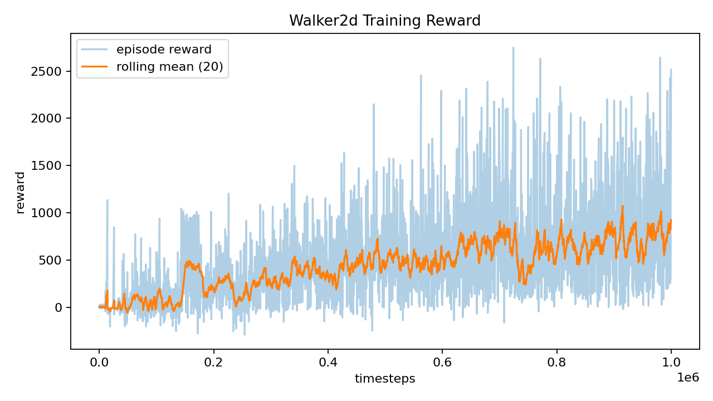
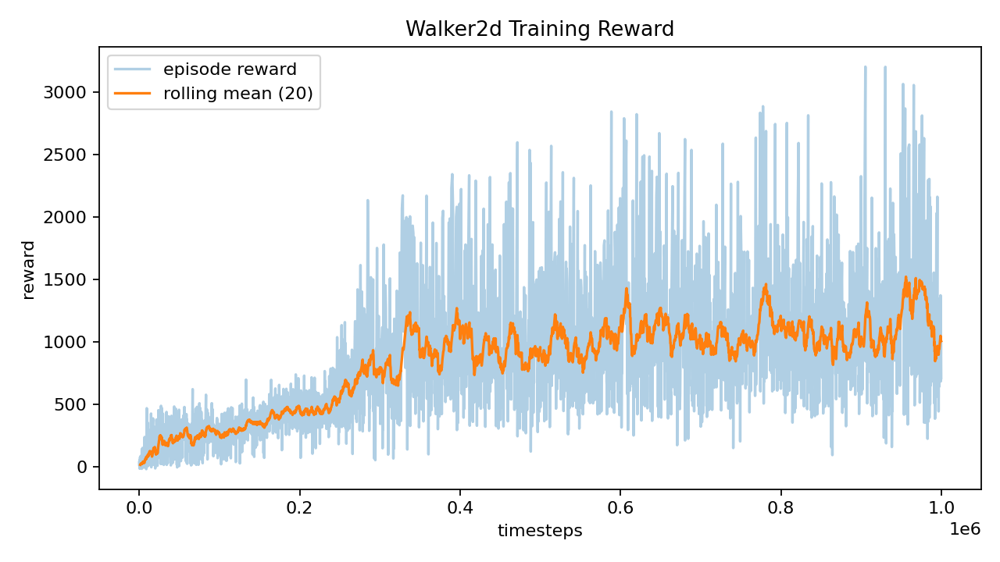
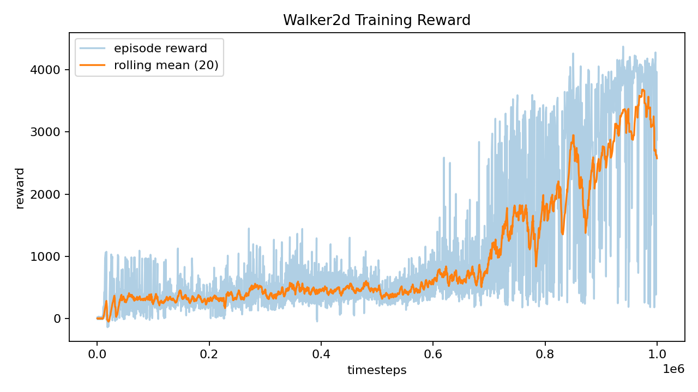

# report.md

## 实验目标
- 掌握强化学习在连续控制任务中的应用，通过智能体与环境的交互实现二足稳定行走控制。
- 训练智能体协调髋/膝等关节的运动策略，使系统在仿真环境中快速、平稳行走。
- 对比不同 Q 函数逼近模型的性能（MLP vs LSTM）；本项目按 AGENTS 约束仅完成 MLP，LSTM 由组内其他成员补充或作为后续工作说明。

## 二足系统介绍
Walker2d 是二维双足机器人模型，由单一躯干、左右两条大腿、左右两条小腿与左右脚共 7 个主要部件组成；通过连接这些部件的 6 个铰链关节施加力矩实现向前行走。（来源：Gymnasium Walker2d 文档）
本实验关注“结构—关节—力矩”的最小描述：每条腿 3 个关节（thigh/leg/foot），对应 6 个关节力矩输入，目标是在保持躯干稳定的同时获得持续前进。（来源：Gymnasium Walker2d 文档）

**图1 二足行走系统示意图**：Walker2d 环境官方示意图（用于展示 2D 双足结构与关节分布）。  

演讲稿：这张图展示了 Walker2d 的基础结构，它是一个二维平面内的双足系统，由躯干和左右两条腿组成。我们要强调的是“二维”和“关节力矩控制”两个关键词：二维意味着运动被约束在一个平面内，主要考察前进速度与稳定性；关节力矩控制意味着动作是对每个关节施加力矩，而不是直接控制位置。实际训练时，智能体就是通过不断调整这些关节力矩，让躯干保持在合理高度与角度区间，同时实现持续向前的步态。

**图2 结构/关节示意图**：通用双足行走机器人结构示意（用于标注关节与连杆关系，便于讲解髋/膝/踝的力矩控制）。  

演讲稿：这张图更清晰地展示了双足系统的连杆与关节关系，我们可以在图上标注髋、膝、踝三个关键关节。对照本实验的动作空间，左右两条腿各 3 个关节，共 6 个关节力矩输出，这正是模型输出动作的含义。通过这张图，观众可以直观看到“动作维度=关节数量”的映射关系，也能理解为什么只要控制 6 个关节力矩，就能形成完整的步态与平衡策略。

> 图源建议：  
> 图1 来源：Gymnasium Walker2d 文档中的 walker2d.png；  
> 图2 来源：Wikimedia Commons “Biped walking robot model human1.png”，使用前需标注作者与许可（CC BY‑SA 3.0 / GFDL）。

## 任务与环境
- 任务环境：Walker2d-v4（Gymnasium/MuJoCo）。二维二足模型由躯干、两侧大腿/小腿与双脚组成，目标是对 6 个铰链关节施加力矩，使机器人协调双腿向前稳定行走。
- 动作空间（代码如何用）：环境动作空间是 `Box(-1, 1, (6,))` 的连续力矩，对应右腿/左腿的 thigh、leg、foot 六个关节扭矩。代码在 `src/train.py` / `src/eval.py` 中读取 `action_limit = max(|env.action_space.high|)`；`ActorMLP`（`src/models/actor.py`）使用 `tanh` 输出并乘以 `action_limit` 保证动作落在合法范围，DDPG/TD3 训练时再加高斯噪声并 `clip` 到 `[-action_limit, action_limit]`。
- 状态空间（代码如何用）：默认 17 维连续向量，位置在前、速度在后；默认不包含躯干 x 位置（可用 `exclude_current_positions_from_observation=False` 加入，info 中始终可取 `x_position`）。本实验不改观测配置，直接用 `env.observation_space.shape[0]` 作为 `obs_dim`，训练与评估均原样输入网络。**17 维具体顺序如下表**。

| 索引 | 状态量 | 含义/单位 |
| --- | --- | --- |
| 0 | rootz | 躯干高度（m） |
| 1 | rooty | 躯干俯仰角（rad） |
| 2 | thigh_joint | 右腿大腿关节角（rad） |
| 3 | leg_joint | 右腿小腿关节角（rad） |
| 4 | foot_joint | 右脚关节角（rad） |
| 5 | thigh_left_joint | 左腿大腿关节角（rad） |
| 6 | leg_left_joint | 左腿小腿关节角（rad） |
| 7 | foot_left_joint | 左脚关节角（rad） |
| 8 | rootx | 躯干 x 速度（m/s） |
| 9 | rootz | 躯干 z 速度（m/s） |
| 10 | rooty | 躯干俯仰角速度（rad/s） |
| 11 | thigh_joint | 右腿大腿关节角速度（rad/s） |
| 12 | leg_joint | 右腿小腿关节角速度（rad/s） |
| 13 | foot_joint | 右脚关节角速度（rad/s） |
| 14 | thigh_left_joint | 左腿大腿关节角速度（rad/s） |
| 15 | leg_left_joint | 左腿小腿关节角速度（rad/s） |
| 16 | foot_left_joint | 左脚关节角速度（rad/s） |
- 奖励函数（代码如何用）：reward = healthy_reward + forward_reward - ctrl_cost；forward_reward 与前进速度 dx/dt 成正比（默认 dt=0.008），ctrl_cost 为动作平方和惩罚（权重 1e-3），healthy_reward 为存活奖励（默认 1）。代码不做额外奖励塑形，直接对 `env.step()` 的 reward 逐步累加得到 `ep_reward` 并写入 `metrics.csv`；速度统计则来自 `info["x_velocity"]`（训练评估、渲染、视频均记录）。
- 终止/截断（代码如何用）：当高度不在 [0.8, 2.0]、躯干角度不在 [-1, 1] 或状态非有限时终止，另有 1000 步截断；代码用 `done = terminated or truncated` 处理结束条件。若需要改上限，可在训练/评估命令中设置 `--max-episode-steps`（传 0 表示使用默认 1000 步）。

**术语解释（本页同步说明）**
- 状态/动作/奖励：状态是环境在每一步返回的 17 维向量；动作是 6 维关节力矩；奖励是 `env.step()` 返回的标量，用于评价当前动作的好坏。
- 回合/步：一步（step）是一次 `env.step()`；回合（episode）是从 reset 到终止/截断的一段完整交互序列。
- 终止/截断：终止（terminated）是达到失败/不健康条件而结束；截断（truncated）是达到时间步上限（默认 1000 步）而结束。
- 随机摩擦：在每次 reset 时随机缩放地面摩擦系数（`friction_low`~`friction_high`），用于增强鲁棒性。
- seed：随机种子，用于控制环境与算法随机性，保证实验可复现（如 `--seed 42`、评估 `seed=123`）。

## 环境与版本
**硬件配置（运行环境）**
| 项目 | 规格 |
| --- | --- |
| CPU | 11th Gen Intel(R) Core(TM) i5-11400H @ 2.70GHz |
| GPU | NVIDIA GeForce RTX 3050 Laptop GPU |
| 内存 | 39.9 GB |
| 操作系统 | Microsoft Windows 11 专业版 |

**软件版本（.venv）**
| 组件 | 版本 |
| --- | --- |
| Python | 3.12.10 |
| PyTorch | 2.9.1+cu126 |
| Gymnasium | 1.2.3 |
| MuJoCo | 3.4.0 |
| NumPy | 2.4.1 |

**环境参数（实验设定）**
| 参数 | 取值 |
| --- | --- |
| env_id | Walker2d-v4 |
| max_episode_steps | 1000（默认 ≈ 8 秒，需改则用 `--max-episode-steps`） |
| 随机摩擦 | `friction_low=0.7`，`friction_high=1.3`（训练/评估可独立开关） |
| seed | 训练 42，评估 123 |

## 方法与模型
**算法选择（与课程要求对齐）**
- **TD3 为主**，DDPG/PPO 作为对比，均适用于连续动作控制任务。
- TD3 通过“双 Q / 延迟策略更新 / 目标策略平滑”缓解过估计与训练不稳，因此作为本实验的主算法。  
- DDPG 属于确定性策略梯度的 actor-critic 方法，是连续控制的经典基线。  
- PPO 采用“剪裁代理目标”，可用多轮小批量更新提升稳定性，作为 on-policy 对比方法。

**三个算法原理（简述）**
- **DDPG**：确定性策略梯度的 actor-critic 方法，使用 actor 输出连续动作，critic 估计 Q 值；通过经验回放与目标网络稳定训练。
- **TD3**：在 DDPG 基础上加入三项关键技巧：双 Q 取最小值抑制过估计、延迟策略更新降低误差传播、目标策略平滑降低 Q 函数尖峰；整体提升稳定性与性能。
- **PPO**：一种 on-policy 策略梯度方法，使用剪裁的代理目标并进行多轮小批量更新，在实现简洁的同时保持训练稳定性。

**算法流程图（TD3，Typora 兼容的 ASCII 图）**


**网络结构（本实验实现）**

- Actor/Critic 均为 MLP：`256-128` 两层全连接 + ReLU。  
- Actor 输出经 `tanh` 缩放到动作范围（`[-action_limit, action_limit]`）。  
- TD3 使用双 critic（Q1/Q2）；DDPG 为单 critic；PPO 为 actor-critic 结构（仅 MLP）。  

**关键机制（实现对应）**

- 经验回放：训练用 replay buffer 随机采样，打破样本相关性。  
- 目标网络软更新：actor/critic 目标网络通过 τ 软更新稳定目标值。  

**限制说明**

- 仅使用 MLP（按 AGENTS 约束），LSTM 未做。  

**参考来源（算法原理）**

- Fujimoto et al., 2018（TD3）；Lillicrap et al., 2015（DDPG）；Schulman et al., 2017（PPO）。  
- Spinning Up 文档：TD3 三个关键技巧的直观解释（双 Q / 延迟更新 / 目标策略平滑）。

## 训练与评估设置
**训练预算**
- 训练步数：≥ 1e6  
- 随机摩擦：训练开启（增强鲁棒性）

**关键超参（表）**
| 参数 | 取值 |
| --- | --- |
| actor_lr / critic_lr | 1e-4 / 1e-4 |
| gamma | 0.99 |
| batch | 64 |
| replay_size | 1e6 |
| tau | 0.005 |
| noise_sigma | 0.1 |
| eval_every | 50k（可备注） |

**评估协议**
- 策略：确定性策略  
- 回合数：20 回合  
- 随机种子：seed=123  
- 摩擦设置：固定摩擦为主（可补随机摩擦对比）

**汇报指标**
- mean_reward / std  
- mean_len  
- mean_speed  

## 结果展示（可视化）
**奖励曲线（2-3 张，标注 run_id / 算法 / 随机摩擦）**
- DDPG（随机摩擦）：`ddpg_mlp_seed42_20260115_203637`  
    
  结论：曲线波动较大，长期回报平台较低，未进入高性能区间。  
- PPO（随机摩擦）：`ppo_mlp_seed42_20260116_115827`  
    
  结论：整体回报高于 DDPG，但波动仍明显，未进入高性能区间。  
- TD3（随机摩擦）：`td3_mlp_seed42_20260116_001048`  
    
  结论：后期平台更高且波动更小，稳定性最好；达到高性能区间（见下方判据）。  

**可选对比图说明**
- 若版面允许，可把 2~3 张曲线叠在同一坐标系，突出 TD3 的稳定性优势。
- 图像来源路径：`logs/<run_id>/reward_curve.png`。

**结果分析（基于曲线与评估记录）**
- DDPG（`ddpg_mlp_seed42_20260115_203637`）：曲线起伏明显、稳定段较少，说明随机摩擦扰动下策略仍不够稳。评估记录显示 mean_reward=956.89、std=730.61，回报平台偏低且波动大。  
- PPO（`ppo_mlp_seed42_20260116_115827`）：整体回报高于 DDPG，但仍存在较大波动。评估记录显示 mean_reward=1755.69、std=699.61，虽均值提升但方差偏大，且高性能阈值未达成。  
- TD3（`td3_mlp_seed42_20260116_001048`）：曲线后期形成高回报平台，波动更小。评估记录 mean_reward=3685.84（最终 4135.44）、std=81.18（方差 6590.83），稳定性最强；高性能阈值（reward≥3000 且 len≥800）在 step=950k 首次连续满足，其他算法未满足。  

**图中如何读出这些结论（PPT 标注方式）**
- **高回报平台**：画 20k~50k 的移动平均线，TD3 后期平台更高且更“平”。  
- **稳定性**：在曲线末段加半透明“均值±std”带，TD3 带宽最窄（std 最小）。  
- **收敛/达标**：画横向阈值线（reward≥3000），在 TD3 的首次连续满足点标竖线（step=950k）；DDPG/PPO 无此标记。  

## 控制效果显示

<video src="https://example.com/video.mp4" controls width="640" height="360"></video>

## 性能对比表（用于汇报）

### 评估范围
- 仅 MLP（符合 AGENTS 约束），不包含 LSTM。
- 评估对象：`logs/` 与 `checkpoints/` 下已存在的 4 个 run_id。
- 评估环境：Walker2d-v4（课程要求）。

### 评估命令（固定摩擦）
```powershell
.\.venv\Scripts\python.exe src\eval.py --model checkpoints\<run_id> --episodes 20 --seed 123
```

### 固定摩擦对比表（20 回合，seed=123）

| run_id | mean_reward | std | mean_len | mean_speed | speed_std |
| --- | --- | --- | --- | --- | --- |
| ddpg_mlp_seed42_20260115_203637 | 956.89 | 730.61 | 420.8 | 1.151 | 0.316 |
| ppo_mlp_seed42_20260116_115827 | 1755.69 | 699.61 | 707.5 | 1.544 | 0.400 |
| ppo_mlp_seed42_20260116_155452 | 220.89 | 21.30 | 114.8 | 0.934 | 0.069 |
| td3_mlp_seed42_20260116_001048 | 3685.84 | 862.01 | 912.0 | 3.019 | 0.170 |

### 随机摩擦对比表（20 回合，seed=123）

| run_id | mean_reward | std | mean_len | mean_speed | speed_std |
| --- | --- | --- | --- | --- | --- |
| ddpg_mlp_seed42_20260115_203637 | 708.38 | 552.12 | 350.1 | 1.031 | 0.271 |
| ppo_mlp_seed42_20260116_115827 | 1541.65 | 689.59 | 607.0 | 1.594 | 0.404 |
| ppo_mlp_seed42_20260116_155452 | 209.70 | 83.31 | 146.7 | 0.779 | 0.295 |
| td3_mlp_seed42_20260116_001048 | 3943.06 | 539.39 | 971.3 | 3.057 | 0.114 |

### 输出位置
- 评估输出：`checkpoints\<run_id>\eval_metrics.json`（已更新为最新 20 回合结果）
- 训练日志：`logs\<run_id>\`
- 奖励曲线：`logs\<run_id>\reward_curve.png`
- 训练视频：`logs\<run_id>\videos\`

### 备注（评估协议）
- Gymnasium 提示 Walker2d-v4 版本已过期（建议 v5），但本次实验按课程要求使用 v4。
- 以上评估均为固定摩擦评估；如需鲁棒性对比，可追加随机摩擦评估并写入本文件。

## 收敛与稳定性分析（PPT具体要点/操作）
**PPT要点（定义与口径统一）**
- **收敛判据（固定摩擦评估，连续 2 次）**：`eval_len_mean ≥ 300` 且 `eval_reward_mean ≥ 500` 且 `eval_speed_mean > 0`。  
- **收敛步数**：首次满足“连续 2 次”判据的评估 step。  
- **稳定性指标**：最终评估的奖励方差 `std^2`（std 来自 eval 输出）。  

**操作步骤（从日志中取数）**

1. 从 `logs/<run_id>/eval.json` 读取每次评估的 `eval_len_mean / eval_reward_mean / eval_speed_mean / eval_reward_std`。  
2. 找到首次“连续 2 次”满足判据的评估 step → 作为“收敛步数”。  
3. 取最后一次评估的 `eval_reward_mean` 作为“最终奖励”，`eval_reward_std^2` 作为“波动方差”。  
4. 在 PPT 放一张小表（3 算法），旁边写一句结论。  

**可直接复现的统计命令**

```powershell
.\.venv\Scripts\python.exe scripts\compute_convergence.py --logdir logs --runs ddpg_mlp_seed42_20260115_203637 ppo_mlp_seed42_20260116_115827 td3_mlp_seed42_20260116_001048
```

**收敛与稳定性小表（固定摩擦评估）**

| 算法 | run_id | 收敛步数 | 最终 eval_reward_mean | 奖励方差（std^2） |
| --- | --- | --- | --- | --- |
| DDPG | ddpg_mlp_seed42_20260115_203637 | 700000 | 1003.93 | 195417.83 |
| PPO | ppo_mlp_seed42_20260116_115827 | 200000 | 1499.98 | 365417.61 |
| TD3 | td3_mlp_seed42_20260116_001048 | 750000 | 4135.44 | 6590.83 |

**高性能收敛（用于“更快达到高性能区间”的判据）**  
- 判据（固定摩擦评估，连续 2 次）：`eval_len_mean ≥ 800` 且 `eval_reward_mean ≥ 3000` 且 `eval_speed_mean > 0`。  

| 算法 | run_id | 高性能收敛步数 |
| --- | --- | --- |
| DDPG | ddpg_mlp_seed42_20260115_203637 | 未达标 |
| PPO | ppo_mlp_seed42_20260116_115827 | 未达标 |
| TD3 | td3_mlp_seed42_20260116_001048 | 950000 |

数据来源：2026-01-17 运行 `scripts/compute_convergence.py` 从 `logs/<run_id>/eval.json` 统计（保留两位小数）。

**一句话结论（PPT 旁注）**

- TD3 最终回报最高且方差最小，稳定性最好；PPO 虽更早满足判据，但波动大；DDPG 收敛较慢且稳定性偏弱。

## 问题-原因-改进建议（PPT具体要点/操作）
**建议用一张四列表（问题→证据→原因→改进），以下内容可直接放表格：**

| 问题 | 证据（来自实验） | 原因分析 | 改进建议 |
| --- | --- | --- | --- |
| 随机摩擦下回合偏短、单回合易摔 | 随机摩擦评估：DDPG mean_len=350.1、mean_reward=708.38；PPO 鲁棒优先 run mean_len=130.0；DDPG 单回合视频长度 308/435 步 | 摩擦扰动大 + 探索噪声不衰减，训练仍处于“高噪声分布”；v4 左右脚摩擦不对称放大扰动 | 课程式随机摩擦（从小到大），训练/评估都启用随机摩擦；降低或退火噪声；延长训练步数 |
| 奖励曲线波动大、收敛慢（DDPG/PPO） | 固定摩擦评估：DDPG std=730.61、PPO std=699.61；收敛步数 DDPG=700k | DDPG 过估计与噪声导致波动；batch=64 + lr=1e-4 收敛偏慢 | 采用 TD3（双 Q/延迟更新/目标平滑）；调大 batch、学习率调度；降低探索噪声 |
| 前倾速度快但姿态不稳 | 评估速度高但仍有摔倒：DDPG mean_speed≈1.23 且 mean_len=439；视频中存在前倾摔倒 | 奖励偏速度，缺少“直立/姿态”惩罚；只在角度/高度越界时终止 | 增加姿态/角度惩罚或能耗权重；对躯干角度设置软约束；更细化的奖励塑形 |
| 长时稳定性欠拟合 | 训练上限 1000 步≈8 秒；单回合扩展评估出现 2 秒摔倒案例（mean_len=362） | 训练与评估时间尺度不一致，策略未学习更长时间稳定性 | 提升/逐步增加 max_episode_steps；用更长回合评估与少量微调 |
| 评估结果对 seed/样本数敏感 | 单回合评估波动大；20 回合均值更稳定 | 随机性强，单样本不足以代表真实性能 | 统一采用 20 回合评估；补充多 seed 统计；必要时报告置信区间 |

## 结论与展望
- 
